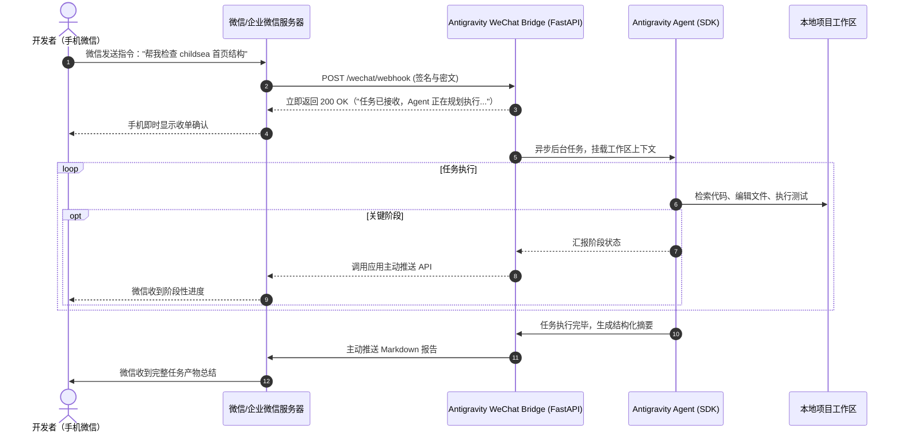

# Antigravity WeChat Bridge 🚀

> **轻量级微信 / 企业微信与 Google Antigravity Agent 远程调度桥接网关**  
> 支持在手机普通微信中发送自然语言指令，远程遥控 Mac / 服务器上的 Antigravity 智能体推进真实代码项目，并将阶段进度与执行总结实时推回微信。

---

## 🌟 核心特性

- 📱 **个人普通微信原生交互**：通过企业微信官方「微信插件」互联，普通微信直接置顶单聊，**手机端无需额外下载企业微信 App**，享受官方 API 稳定通道，**0 封号风险**。
- ⚡ **即时收单 + 异步长任务执行**：针对微信 5 秒 Webhook 超时限制设计，收到任务后毫秒级被动响应，后台异步调度 Antigravity Agent 深度工作，执行完毕主动推送 Markdown 格式总结。
- 🧠 **原生打通 Antigravity 体系**：基于 `google-antigravity` SDK，直接挂载本地工作区目录、项目上下文与已配置的全部 Agent Skills。
- 🛡️ **企业级访问控制**：支持 `ALLOWED_USER_IDS` 权限白名单与指令审计，防止未授权成员滥用本地执行权限。
- 🖥️ **本地开箱即测**：提供 `/api/dispatch` REST 接口与测试脚本，无需预先配置微信凭证即可在本地验证 Agent 派单闭环。
- 🔄 **24/7 后台长驻**：开箱支持 macOS `launchd` 开机守护与 Docker 容器化部署。

---

## 🏗️ 系统架构



---

## 🚀 极速上手

### 1. 克隆项目与安装依赖

```bash
git clone https://github.com/cnproduct/antigravity-wechat-bridge.git
cd antigravity-wechat-bridge

# 安装 Python 依赖
pip3 install -r requirements.txt
```

### 2. 配置环境变量

复制配置文件模版并修改：

```bash
cp .env.example .env
```

核心配置项说明：

| 变量名 | 说明 | 示例 |
| :--- | :--- | :--- |
| `WECHAT_CORP_ID` | 企业微信企业 ID（后台「我的企业」底部） | `ww1234567890abcdef` |
| `WECHAT_AGENT_ID` | 自建应用 AgentId | `1000002` |
| `WECHAT_CORP_SECRET`| 自建应用 Secret | `your_secret_here` |
| `WECHAT_TOKEN` | 接收消息 Token（配置回调时生成） | `your_random_token` |
| `WECHAT_ENCODING_AES_KEY` | 接收消息 43 位 AES 密钥 | `your_43_chars_aes_key` |
| `ALLOWED_USER_IDS` | 授权执行 Agent 任务的企业微信 UserID 列表 | `happy,admin` |
| `AGENT_DEFAULT_WORKSPACE` | Agent 默认操作的代码工作区绝对路径 | `/Users/happy/.../diaperwebsites` |
| `AGENT_MODEL` | 驱动模型 | `gemini-3.8-flash` |
| `ANTIGRAVITY_APP_DATA_DIR` | Antigravity 本地数据目录 | `~/.gemini/antigravity` |
| `TENANTS_DIR` | 多租户物理沙盒根目录（自动为每个用户隔离） | `~/.gemini/antigravity/tenants` |
| `SESSION_STORE_PATH` | 用户与 Conversation ID 绑定表持久化路径 | `~/.gemini/antigravity/wechat_sessions.json` |
| `MAX_CONCURRENT_TASKS` | 单机最大并发执行数（超出排队） | `5` |
| `FILE_RETENTION_DAYS` | 微信上传临时附件自动保留天数 | `7` |

### 3. 本地启动服务

```bash
bash scripts/run_local.sh
```

服务默认启动在 `http://127.0.0.1:8000`。
访问 `http://127.0.0.1:8000/docs` 可查看交互式 API 文档。

### 4. 本地免微信直连测试

在服务运行状态下，开启新终端直接执行：

```bash
python3 scripts/test_webhook.py "请检查当前工作区，列出项目主要结构并给出项目概览"
```

你将看到本地 Agent 立即被唤起并开始分析项目结构！

---

## 📲 企业微信对接指南（0 封号、普通微信免装 App）

1. **注册企业微信**：访问 [work.weixin.qq.com](https://work.weixin.qq.com/)，个人手机号免费注册一个企业（无需营业执照）。
2. **创建自建应用**：进入「应用管理」->「自建」->「创建应用」，名称可设为 `Antigravity 研发助理`。
3. **开启微信插件（关键）**：
   - 进入后台「我的企业」->「微信插件」。
   - 用你的**个人普通微信扫码关注**。
   - 关注后，该应用会直接出现在您个人微信的聊天列表和通讯录中！
4. **配置公网回调地址**：
   - 使用内网穿透（如 `cloudflared tunnel --url http://localhost:8000` 或 `cpolar http 8000`）。
   - 在应用详情页点击「设置 API 接收」：
     - **URL**: `https://<你的穿透域名>/wechat/webhook`
     - **Token**: 点击随机获取，填入 `.env`
     - **EncodingAESKey**: 点击随机获取，填入 `.env`
   - 保存即可完成双向打通！

---

## 👥 多租户会话与沙盒隔离（杜绝店铺串联）

本项目支持**同一台电脑 / 云主机承载多位微信用户同时进行对话与自动化上架**，采用三维强隔离设计：

1. **1:1 会话映射**：每个微信成员自动分配专属独立的 `conversation_id`，对话上下文与店铺授权物理隔离。
2. **物理沙盒目录**：用户上传的所有文件与任务产物存放在 `tenants/{user_id}/{conversation_id}/` 下，互不干扰、防重名覆盖。
3. **防串联安全保障**：所有底层调用强制注入环境变量 `ANTIGRAVITY_CONVERSATION_ID`，严格杜绝 A 用户的商品被误上架到 B 用户店铺。
4. **微信发送文件直接处理**：在微信单聊中点击「+」直接发送 `.txt` SKU 清单或表格，网关自动接收落盘并让智能体开始提取分析与上架。

### 💬 微信端常用快捷指令

在微信聊天窗口中直接发送以下指令即可触发相应功能：

| 指令 | 说明 | 示例回复 |
| :--- | :--- | :--- |
| `直接文字` | 自然语言向智能体下达指令 | “帮我检查店铺状态并准备按6倍上架” |
| `直接发文件` | 微信发送 `.txt` 等 SKU 文本或表格 | “已安全接收文件【skus.txt】并存放于您的独立沙盒...” |
| `/reset` | 重置当前会话，开启全新的独立会话窗口 | “🔄 会话重置成功！新会话 ID: `...`” |
| `/status` | 查询当前用户的会话 ID、沙盒路径与并发排队状态 | “📊 [当前会话状态] 用户ID / 会话ID / 队列数” |
| `/clean` | 手动清理超过保留天数的历史上传临时文件 | “🧹 已完成历史文件清理，共清理 X 个过期附件。” |
| `/help` | 查看详细指令说明与操作提示 | 打印全部功能与使用建议 |

---

## 🚦 并发排队与横向扩容机制

- **单用户串行排队锁**：防止同一用户在手机上短时间内连续狂点导致同一会话状态读写撕裂。
- **全局并发限流信号量**：支持设置 `MAX_CONCURRENT_TASKS`（如 4G 内存设 3，8G 设 5）。超出限制的任务自动在后台排队，并在微信端温和提示用户正在排队。
- **多云主机横向扩展（Scale-Out）**：支持多台云主机各自运行 Antigravity，挂载同一个 Antigravity 商业账号，统一由前端网关按 UserID 粘性分发，无缝支撑数百商家并发上架。

---

## 🛡️ 安全与权限控制

- **UserID 白名单过滤**：由于终端 Agent 拥有操作本地文件与执行系统命令的权限，强烈建议在 `.env` 中严格设置 `ALLOWED_USER_IDS`。任何非白名单成员在微信发消息都会被直接拦截并回复鉴权失败提示。
- **工作区路径边界**：Agent 默认限制在指定的工作区目录下执行文件读写与代码检查。

---

## 🖥️ 生产长驻后台运行

### macOS LaunchAgent（开机后台自启）

```bash
cp deploy/com.cnproduct.antigravity-wechat-bridge.plist ~/Library/LaunchAgents/
launchctl load ~/Library/LaunchAgents/com.cnproduct.antigravity-wechat-bridge.plist
```

### Docker 容器部署

```bash
docker compose -f deploy/docker-compose.yml up -d
```

---

## 📄 开源许可

[MIT License](LICENSE) © 2026 cnproduct
